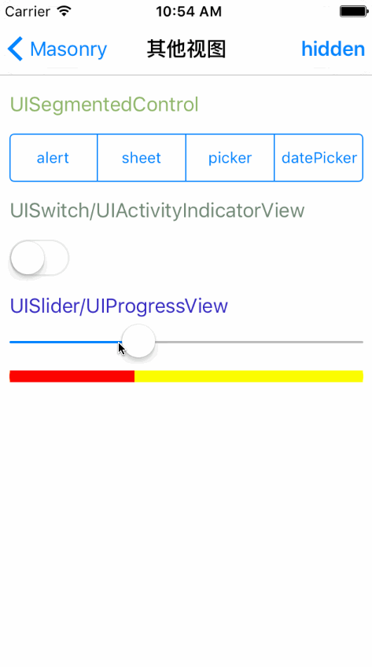

# SYDemo_Masonry
使用masonry进行适配

效果图
 * UILabel标签（含多行自适应）
 *

 * UI视图（其他UI）
 *

 * UITabelView列表视图
 *

 * UICollectionView瀑布视图
 *

 * UIScrollView滚动视图
 *

 * Animation动画效果
 *

 * 登录视图示例
 *

#常用方法
 * 1 添加约束 mas_makeConstraints
 * 2 更新约束、也可以添加新约束 mas_updateConstraints
 * 3 重置之前的约束 mas_remakeConstraints

#使用注意事项
 * 1、使用autolayout之前，一定要将视图添加到父视图上，否则会报错。
 * 2、使用autolayout时，不能同事对同一个视图使用mas_makeConstraints，否则会报错。
 * 3、使用autolayout时，如果非要修改约束时，可使用mas_updateConstraints进行修改更新。
 * 4、使用autolayout时，可使用mas_remakeConstraints清除之前的所有约束，仅保留最新的约束。
 * 5、mas_equal支付的数据类型包括：NSNumber，CGPoint，CGSize，UIEdgeInsets。
 * 6、equalTo与mas_equalTo的区别：equalTo比较的是view，而mas_equalTo比较的是值。
 * 7、边界中顶部、左侧边界的数值为正整数；而底部、右侧边界的数值为负整数（原因在于计算的是绝对的数值，即计算的底部，或右侧边界的数值时，相对的视图底部高度，或右侧宽度，所以要负数）。
 * 8、多个视图的父视图相同时，须先实例化多个视图，且多个视图都添加到视图后才进行约束设置。
 * 9、更新约束后，需要刷新UI布局时，需要调用下面的方法
~~~ javascript
- (void)setNeedsLayout;
- (void)layoutIfNeeded;
- (void)setNeedsUpdateConstraints;
~~~
  * 情况1：实例化UI后，先通过mas_makeConstraints添加约束，然后再通过mas_updateConstraints修改更新某一个约束，然后再调用layoutIfNeeded
~~~ javascript
// 1 添加约束
[view mas_makeConstraints:^(MASConstraintMaker *make) {
    make.center.equalTo(self.view);
    make.size.mas_equalTo(CGSizeMake(80.0, 80.0));
}];

// 2 修改更新约束
[view mas_updateConstraints:^(MASConstraintMaker *make) {
    make.top.mas_equalTo(originTop);
    make.left.mas_equalTo(originLeft);
}];

// 3 调用更新
[self.view layoutIfNeeded];
~~~
  * 情况2：实例化UI后，先通过mas_makeConstraints添加约束，然后再通过mas_remakeConstraints重置所有约束，然后再调用layoutIfNeeded
~~~ javascript
// 1 添加约束
[view mas_makeConstraints:^(MASConstraintMaker *make) {
    make.center.equalTo(self.view);
    make.size.mas_equalTo(CGSizeMake(80.0, 80.0));
}];

// 2 重置所有约束
[view mas_remakeConstraints:^(MASConstraintMaker *make) {
    make.top.mas_equalTo(originTop);
    make.left.mas_equalTo(originLeft);
    make.size.mas_equalTo(CGSizeMake(80.0, 80.0));
}];

// 3 调用更新
[self.view layoutIfNeeded];
~~~
  * 情况3：实例化UI后，暂不添加约束，后通过updateViewConstraints方法里添加约束mas_updateConstraints，然后再调用setNeedsUpdateConstraints、layoutIfNeeded
~~~ javascript
// 1 
- (void)updateViewConstraints
{
    [view mas_updateConstraints:^(MASConstraintMaker *make) {
        make.center.equalTo(self.view);
        make.size.mas_equalTo(self.sizeScale);
    }];

    [super updateViewConstraints];
}

// 2 调用更新
[self.view setNeedsUpdateConstraints];
[self.view layoutIfNeeded];
~~~

#使用设置
 * 1、居中设置
  * 垂直居中：make.centerY.mas_equalTo(self.window.mas_centerY)
  * 水平居中：make.centerX.mas_equalTo(self.window.mas_centerX)
  * 全屏居中：make.center.equalTo(self.window)

 * 2、边界设置
  * 上边界：make.top.equalTo(self.window).with.offset(15.0)
  * 左边界：make.left.equalTo(self.window).with.offset(15.0)
  * 下边界：make.bottom.equalTo(self.window).with.offset(-15.0)
  * 右边界：make.right.equalTo(self.window).with.offset(-15.0)
  * 或：
  * 上边界：make.top.mas_equalTo(15.0)
  * 左边界：make.left.mas_equalTo(15.0)
  * 下边界：make.bottom.mas_equalTo(-15.0)
  * 右边界：make.right.mas_equalTo(-15.0)
  * 或：
  * 上边界、左边界：make.top.left.mas_equalTo(15.0)
  * 下边界、右边界：make.bottom.right.mas_equalTo(-15.0)
  * 或：
  * make.top.left.bottom.and.right.equalTo(self.window).with.insets(UIEdgeInsetsMake(15.0,15.0,15.0,15.0))
  * 或：
  * make.edges.equalTo(self.window).with.insets(UIEdgeInsetsMake(15.0,15.0,15.0,15.0))
  * 与另一个视图的边界间距设置
  * 与另一个视图右部边界间距：
  * make.right.mas_equalTo(currentView.mas_left).offset(10.0);
  * 与另一个视图底部边界间距：
  * make.top.mas_equalTo(currentView.mas_bottom).offset(10.0);

 * 3、equalTo与mas_equalTo有什么区别？
  * equalTo比较的是view
  * mas_equalTo比较的是数值

 * 4、and和with？
  * 什么事情都没做，只是增加代码可读性。

 * 5、倍数设置
  * 设置宽度为self.view的一半，multipliedBy是倍数的意思，也就是，使宽度等于self.view宽度的0.5倍
  * make.width.equalTo(self.view.mas_width).multipliedBy(0.5);
  * 设置高度为self.view高度的一半
  * make.height.equalTo(self.view.mas_height).multipliedBy(0.5);

 * 6、大小设置
  * （1）宽：
  * make.width.equalTo(self.view.mas_width).multipliedBy(0.5);
  * 或：make.width. mas_equalTo(320.0).multipliedBy(0.5);
  * 或：make.width. mas_equalTo(160.0);
  * （2）高：make.height.equalTo(self.view.mas_height).multipliedBy(0.5);
  * 或：make.height. mas_equalTo(320.0).multipliedBy(0.5);
  * 或：make.height. mas_equalTo(160.0);
  * （3）size：make.size. mas_equalTo(CGSizeMake(300.0,50.0));
  * 或：make.size.equalTo(view);
  * 或：make.size.mas_equalTo(CGSizeMake(150.0,50.0)).multipliedBy(0.5);
  * 或：make.edges.equalTo(self.view);

#疑问：
 * 1、UILable如何设置多行显示？

~~~ javascript
self.detailLabel = [UILabel new]; 
self.detailLabel.font = [UIFont systemFontOfSize:15]; 
self.detailLabel.backgroundColor = [UIColor whiteColor]; 
[self addSubview:self.detailLabel]; 
// 多行自适应显示
// 情况1 多行自适应显示，无需设置高度约束
self.detailLabel.numberOfLines = 0; 
self.detailLabel.preferredMaxLayoutWidth = ([UIScreen mainScreen].bounds.size.width - 2 * 10.0); // 要是设置多行Label的话,必须设置此属性 
[self.detailLabel setContentHuggingPriority:UILayoutPriorityRequired forAxis:UILayoutConstraintAxisVertical];
[self.detailLabel mas_makeConstraints:^(MASConstraintMaker *make) { 
    make.top.mas_equalTo(self.footTitleBackView.mas_bottom).offset(5); 
    make.left.and.right.mas_equalTo(0); 
    make.bottom.mas_equalTo(self.mas_bottom); 

    // 无需设置高度约束
}]; 

// 情况2 多行自适应显示，计算高度，设置高度约束（不足：可能会造成文本显示不全）
self.detailLabel.numberOfLines = 0; 
CGFloat height = [self.detailLabel.text boundingRectWithSize:CGSizeMake(([UIScreen mainScreen].bounds.size.width - 2 * 10.0), MAXFLOAT) options:NSStringDrawingUsesLineFragmentOrigin attributes:@{NSFontAttributeName:self.detailLabel.font} context:nil].size.height;
[self.detailLabel mas_makeConstraints:^(MASConstraintMaker *make) { 
    make.top.mas_equalTo(self.footTitleBackView.mas_bottom).offset(5); 
    make.left.and.right.mas_equalTo(0); 
    make.bottom.mas_equalTo(self.mas_bottom); 

    // 设置高度约束
    make.height.mas_equalTo(height);
}]; 
~~~

 * 2、UITextView如何设置自适应多行显示？
UITextView实始化时，设置的约束只能显示一行，随着输入内容的不断增多，可以在代理方法中实现高度自适应，即重新更新高度约束。
~~~ javascript
// 初始化约束
[textview mas_makeConstraints:^(MASConstraintMaker *make) {
    make.top.mas_equalTo(currentView.bottom).offset(10);
    make.left.equalTo(currentView);
    make.right.mas_equalTo(-10);
    make.height.mas_equalTo(40);
}];

// 代理方法中更新高度约束
- (BOOL)textView:(UITextView *)textView shouldChangeTextInRange:(NSRange)range replacementText:(NSString *)text
{
    if (1001 == textView.tag)
    {
        NSString *string = [textView.text stringByReplacingCharactersInRange:range withString:text];
        NSLog(@"string = %@", string);

        CGSize size = [string boundingRectWithSize:CGSizeMake((self.view.frame.size.width - 10.0 * 2), MAXFLOAT) options:NSStringDrawingUsesLineFragmentOrigin attributes:@{NSFontAttributeName:[UIFont systemFontOfSize:12.0]} context:nil].size;
        CGFloat height = size.height;
        NSLog(@"height = %@", @(height));

        // 根据实际高度，更新约束
        if (height > textView.frame.size.height)
        {
            [textView mas_updateConstraints:^(MASConstraintMaker *make) {
                make.height.mas_equalTo(height);
            }];
        }
    }

    return YES;
}
~~~ 

 * 3、UISCrollView如何设置contentSize？
  * 通过过渡视图设置。
  * （1）containerView为crollView的过渡子视图（垂直设置原理说明）；
  * （2）containerView相对于crollView的约束为make.top.left.bottom.and.right.equalTo(crollView).with.insets(UIEdgeInsetsZero);
make.width.equalTo(crollView);
  * （3）containerView的多个子视图label，且containerView的高度约束最终为最后一个子视图label：make.bottom.equalTo(label.mas_bottom);  
  * （4）containerView的高度约束，即为crollView的垂直方向的高度约束。
~~~ javascript
// 垂直方向
UIScrollView *verticalScrollView = [[UIScrollView alloc] init];
......
// 设置scrollView的子视图，即过渡视图contentSize，并设置其约束
UIView *verticalContainerView = [[UIView alloc] init];
[verticalScrollView addSubview:verticalContainerView];
[verticalContainerView mas_makeConstraints:^(MASConstraintMaker *make) {
    make.top.left.bottom.and.right.equalTo(verticalScrollView).with.insets(UIEdgeInsetsZero);
    make.width.equalTo(verticalScrollView);
}];
// 过渡视图添加子视图
UIView *lastView = nil;
for (NSInteger index = 0; index < 10; index++)
{
    UILabel *label = [[UILabel alloc] init];
    ......

    // 添加到父视图，并设置过渡视图中子视图的约束
    [verticalContainerView addSubview:label];
    [label mas_makeConstraints:^(MASConstraintMaker *make) {
        make.left.and.right.equalTo(verticalContainerView);
        make.height.mas_equalTo(verticalScrollView.mas_height);

        if (lastView)
        {
            make.top.mas_equalTo(lastView.mas_bottom);
        }
        else
        {
            make.top.mas_equalTo(0);
        }
    }];

    lastView = label;
}

// 设置过渡视图的底边距（此设置将影响到scrollView的contentSize）
[verticalContainerView mas_makeConstraints:^(MASConstraintMaker *make) {
    make.bottom.equalTo(lastView.mas_bottom);  
}];
 
// 水平方向
UIScrollView *horizontalScrollView = [[UIScrollView alloc] init];
......
// 设置scrollView的子视图，即过渡视图contentSize，并设置其约束
UIView *horizontalContainerView = [[UIView alloc] init];
[horizontalScrollView addSubview:horizontalContainerView];
[horizontalContainerView mas_makeConstraints:^(MASConstraintMaker *make) {
    make.edges.equalTo(horizontalScrollView);
    make.height.equalTo(horizontalScrollView);
}];
// 过渡视图添加子视图
UIView *previousView = nil;
for (int i = 0; i < 10; i++)
{
    UILabel *label = [[UILabel alloc] init];
    ......

    // 添加到父视图，并设置过渡视图中子视图的约束
    [horizontalContainerView addSubview:label];
    [label mas_makeConstraints:^(MASConstraintMaker *make) {
        make.top.and.bottom.equalTo(horizontalContainerView);
        make.width.equalTo(horizontalScrollView);

        if (previousView)
        {
            make.left.mas_equalTo(previousView.mas_right);
        }
        else
        {
            make.left.mas_equalTo(0);
        }
    }];

    previousView = label;
}
// 设置过渡视图的右距（此设置将影响到scrollView的contentSize）
[horizontalContainerView mas_makeConstraints:^(MASConstraintMaker *make) {
    make.right.mas_equalTo(previousView.mas_right);  
}];
~~~ 

 * 4、UITableView如何设置UITableViewCell的高度？
  * 在自自定义，或系统的UITableViewCell中，根据数据model显示，或隐藏UI子视图，以及UILabel的自适应显示（需要先设置多行自适应显示的属性）。同时，在代理方法中设置计算返回的高度。
~~~ javascript
// UILabel多行自适应显示属性
self.detailLabel.numberOfLines = 0;
self.detailLabel.preferredMaxLayoutWidth = ([UIScreen mainScreen].bounds.size.width - 10.0 * 2);
[self.detailLabel setContentHuggingPriority:UILayoutPriorityRequired forAxis:UILayoutConstraintAxisVertical];

// UI子视图显示，或隐藏约束。如：
NSString *name = model.imageName;
if (name && 0 != name.length)
{
    UIImage *image = [UIImage imageNamed:name];
    self.iconImageView.image = image;
}
[self.iconImageView mas_updateConstraints:^(MASConstraintMaker *make) {
    make.top.mas_equalTo(self.detailLabel.mas_bottom).offset(originXY);
    make.size.mas_equalTo((name && 0 != name.length) ? CGSizeMake(sizeImage, sizeImage) : CGSizeZero);
}];        
[self layoutIfNeeded];

// 计算高度
+ (CGFloat)heightTableCellWithModel:(Model *)model
{
    // 初始化高度
    CGFloat height = ....;

    // 计算高度
    NSString *text = model.content;
    CGFloat heightText = [text boundingRectWithSize:CGSizeMake(([UIScreen mainScreen].bounds.size.width - 2 * 10.0), MAXFLOAT) options:NSStringDrawingUsesLineFragmentOrigin attributes:@{NSFontAttributeName:[UIFont systemFontOfSize:12.0]} context:nil].size.height;
    height += heightText;

    NSLog(@"heightTableCell = %f, heightText = %f", height, heightText);

    return height;
}

// 代理方法中设置高度
- (CGFloat)tableView:(UITableView *)tableView heightForRowAtIndexPath:(NSIndexPath *)indexPath
{
    Model *model = self.array[indexPath.row];
    CGFloat height = [UITableViewCell heightTableCellWithModel:model];

    return height;
}
~~~ 

 * 5、如何处理动画效果？
  * 实现动画效果，即修改更新UI的约束即可，可以使用mas_updateConstraints更新某个约束，也可以使用mas_remakeConstraints清除之前的约束，重新设置所有约束。但不管何种方式，都需要UI所有的父视图调用方法"- (void)layoutIfNeeded;"。
~~~ javascript
// 初始约束
[aniView mas_makeConstraints:^(MASConstraintMaker *make) { 
    make.top.equalTo(self.view).offset(10); 
    make.left.equalTo(self.view).offset(10); 
    make.right.equalTo(self.view).offset(-10); 
    make.height.equalTo(@(80)); 
}];
// 更新某个约束
[aniView mas_updateConstraints:^(MASConstraintMaker *make) { 
    make.top.equalTo(self.view).offset(30); 
}];
// 或更新所有约束
[aniView mas_remakeConstraints:^(MASConstraintMaker *make) { 
    make.top.equalTo(self.view).offset(30); 

    make.left.equalTo(self.view).offset(10); 
    make.right.equalTo(self.view).offset(-10); 
    make.height.equalTo(@(80)); 
}];
// 动画
[UIView animateWithDuration:3 animations:^{ 
    [self.view layoutIfNeeded]; 
}];
~~~ 

 * 6、如何动态修改约束
  * 使用mas_updateConstraints修改更新某一个约束
  * 使用mas_remakeConstraints，清除之前的所有约束，重新添加约束

 * 7、如何获取约束里设置的值，或是获取约束对象的frame

 * 8、约束中edge、size设置的区别
  * 设置某个子视图的大小与其父视图相同大小时，如frame中设置：label.frame = self.view.bounds;，可以使用size约束，也可以使用edges约束。
  *（1）size约束（可能会出现约束异常）：make.size.equalTo(self.view);
  *（2）edges约束（建议使用此方法）：make.edges.equalTo(self.view);

